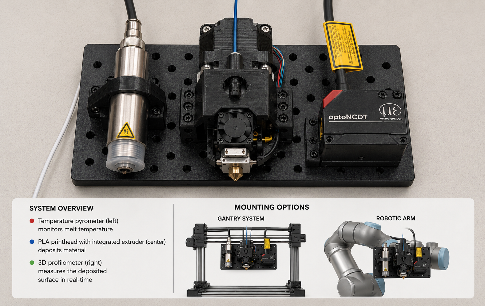

# FUSE-Head
Feedback Unit for Sensing and Extrusion (FUSE) Head

Plan for the FUSE print head

## Licensing and Citation

[![CC BY-SA 4.0][cc-by-sa-shield]][cc-by-sa]

This work is licensed under a
[Creative Commons Attribution-ShareAlike 4.0 International License][cc-by-sa].

[cc-by-sa]: http://creativecommons.org/licenses/by-sa/4.0/
[cc-by-sa-image]: https://licensebuttons.net/l/by-sa/4.0/88x31.png
[cc-by-sa-shield]: https://img.shields.io/badge/License-CC%20BY--SA%204.0-lightgrey.svg

Cite as:

David Wamai, Hasan Borke Birgin, Austin Downey, and Joud Satme. Biphasic data acquisition system. GitHub. URL: https://github.com/ARTS-Laboratory/Biphasic-data-acquisition-system
 
in bibtex

@Misc{ARTSLabBiphasicDataAcquisition,   
  author       = {{ARTS-Lab}},  
  howpublished = {GitHub},  
  title        = {{FUSE-Head}},   
  groups       = {{ARTS-L}ab},  
  url          = {https://github.com/ARTS-Laboratory/FUSE-Head},  
  note  = {Accessed: Month dd, yyyy},   
}

QR code for repo.

